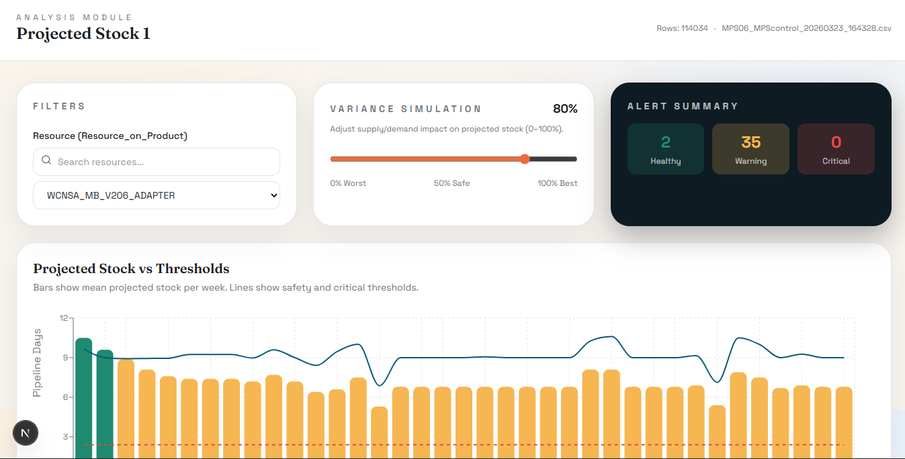

# MPS Control Dashboard

<div align="center">
  
[](https://opensource.org/licenses/MIT)
[](https://nextjs.org)
[](https://fastapi.tiangolo.com)

</div>


**MPS Control Dashboard** is a smart data visualization and monitoring platform that transforms raw Excel spreadsheets into interactive dashboards and actionable business insights. The system automates data extraction, cleaning, aggregation, and visualization processes, allowing users to track KPIs, operational metrics, performance indicators, and trends in real time through dynamic charts, tables, and analytics panels.

The platform simplifies decision-making by converting complex Excel data into clear and professional dashboards with filtering, reporting, and export capabilities. It supports automated updates, multi-source Excel integration, and customizable visual components tailored to organizational needs.

### 🌐 Live Demo

[](https://mps-control-dashboard.vercel.app/)

## ✨ Key Features

- **🔄 Automated Data Processing** - Seamlessly extract, clean, and aggregate data from multiple Excel sources
- **📈 Real-Time Dashboards** - Interactive visualizations with live data updates
- **📊 Advanced Analytics** - Track KPIs, operational metrics, and performance indicators
- **🎯 Custom Filtering** - Dynamic filtering capabilities for granular data analysis
- **📥 Multi-Source Integration** - Support for multiple Excel file uploads and consolidation
- **🎨 Customizable Components** - Tailored visual components to meet organizational needs
- **📤 Export Capabilities** - Generate reports and export data in multiple formats
- **⚡ Performance Optimized** - Fast load times and responsive design for seamless user experience

## 🛠️ Tech Stack

### Frontend

- **Framework**: Next.js 16 
- **Styling**: Tailwind CSS 4
- **State Management**: Zustand
- **Charting**: Recharts
- **UI Icons**: Lucide React
- **Language**: TypeScript

### Backend

- **Framework**: FastAPI
- **Server**: Uvicorn
- **Data Processing**: Pandas
- **Excel Handling**: OpenPyXL
- **Validation**: Pydantic
- **Language**: Python 3.11

## 🚀 Getting Started

### Prerequisites

- Node.js 18+ and npm
- Python 3.8+
- Git

### Installation

1. **Clone the repository**

   ```bash
   git clone https://github.com/BellilxDhaker/MPS-control-dashboard.git
   cd MPS-control-dashboard
   ```

2. **Setup Backend**

   ```bash
   cd backend
   pip install -r requirements.txt
   ```

3. **Setup Frontend**
   ```bash
   cd frontend
   npm install
   ```

### Running the Application

#### Start Backend

```bash
cd backend
python -m uvicorn main:app --reload --host 0.0.0.0 --port 8000
```

The API will be available at `http://localhost:8000`

#### Start Frontend

```bash
cd frontend
npm run dev
```

The dashboard will be available at `http://localhost:3000`

## 📁 Project Structure

```
MPS-control-dashboard/
├── backend/
│   ├── api/                 # API routes and endpoints
│   ├── schemas/             # Data models and schemas
│   ├── services/            # Business logic and data processing
│   ├── utils/               # Utility functions
│   ├── config.py            # Configuration settings
│   ├── main.py              # FastAPI application entry point
│   └── requirements.txt      # Python dependencies
│
└── frontend/
    ├── app/                 # Next.js app directory
    │   ├── dashboard/       # Dashboard pages and layouts
    │   └── page.tsx         # Home page
    ├── components/          # Reusable React components
    ├── lib/                 # Utility functions and store
    ├── public/              # Static assets
    └── package.json         # Node.js dependencies
```

## 💡 Usage

1. **Upload Excel Files**
   - Navigate to the upload section
   - Select one Excel files
   - System automatically processes and validates the data

2. **View Dashboards**
   - Browse pre-configured dashboards
   - Real-time data visualization and metrics

3. **Apply Filters**
   - Use dynamic filters to drill down into specific data
   - Customize date ranges, categories, and metrics

4. **Export Reports**
   - Generate custom reports
   - Export data in your preferred format

## 📚 API Documentation

Once the backend is running, access the interactive API documentation:

- **Swagger UI**: `http://localhost:8000/docs`
- **ReDoc**: `http://localhost:8000/redoc`

## 🔧 Environment Configuration

### Backend Environment Variables

Create a `.env` file in the backend directory:

```
ALLOWED_ORIGINS=http://localhost:3000,http://127.0.0.1:3000
```

### Frontend Environment Variables

Create a `.env.local` file in the frontend directory:

```
NEXT_PUBLIC_API_URL=http://localhost:8000
```

## 📦 Available Scripts

### Frontend

- `npm run dev` - Start development server
- `npm run build` - Build for production
- `npm start` - Start production server
- `npm run lint` - Run ESLint

### Backend

- `python -m uvicorn main:app --reload` - Start development server
- `python test_api.py` - Run API tests

## 🤝 Contributing

Contributions are welcome! Please follow these steps:

1. Fork the repository
2. Create a feature branch (`git checkout -b feature/amazing-feature`)
3. Commit your changes (`git commit -m 'Add amazing feature'`)
4. Push to the branch (`git push origin feature/amazing-feature`)
5. Open a Pull Request

## 📝 License

This project is licensed under the MIT License - see the LICENSE file for details.


## 🚀 Deployment

The application is currently deployed on Vercel:

- **Live URL**: [https://mps-control-dashboard.vercel.app/](https://mps-control-dashboard.vercel.app/)
